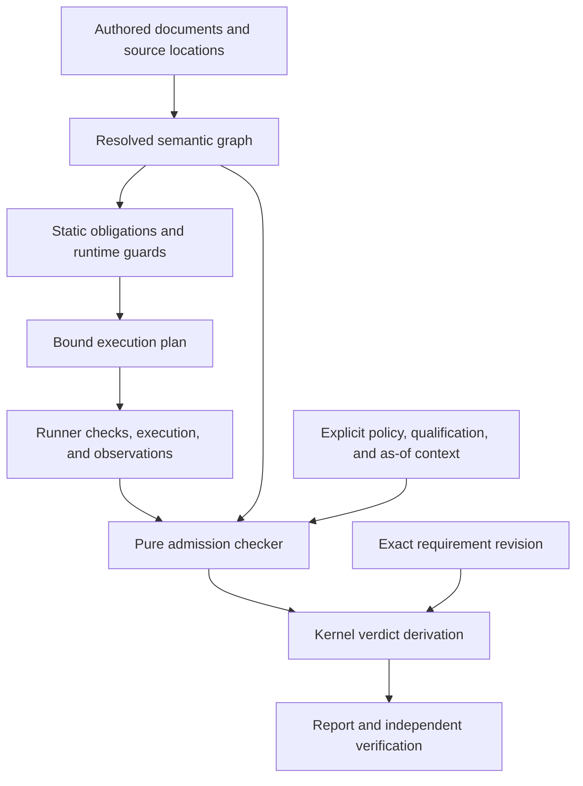

# Rust-informed semantic architecture for Avila Core

The owner's 25 September follow-up is developed in the
[engineering language charter](2026-09-25-engineering-language-charter.md) and
[EL handoff](../ENGINEERING_LANGUAGE_HANDOFF.md). They define the next language
experiment; this document retains the earlier research and architecture rationale.

Date: 24 September 2026. Status: proposal for discussion. Repository inspection
baseline: `0ee55d08be7000b93dbf8da56d6e7f5b3830f22f`. Rust sources were consulted
on the same date. Proposed names and judgments below describe a target design;
they are not existing APIs or established guarantees.

The [SWE-2 implementation handoff](../RUST_ARCHITECTURE_HANDOFF.md) specifies
the first complete implementation slice, its acceptance tests, and the gated
follow-on increments. The research below supplies the architectural rationale.

**Core should make the validity of engineering operations compositional.**
Each operation should state what it requires, establish a precisely bounded
result, and preserve the dependencies and assumptions that make that result
usable. The implementation and the engineering language both need to enforce
this contract. Private constructors are one necessary mechanism within that
larger architecture.

This develops [ADR-0006](../../adr/0006-semantic-core.md), particularly SC-5,
SC-11, SC-12, and SC-15. The earlier
[architecture proposal](2026-09-04-architecture-and-execution-roadmap.md)
already proposed obligations, conditional derivations, and incremental
analysis. Its [review](../reviews/2026-09-04-architecture-proposal-review.md)
and [S-034](../../../DECISIONS.md) retain gates on sessions, stores, obligation
graphs, and scheduling infrastructure. This proposal defines the semantic
target and a small way to test it; adoption would require explicit decisions
about any change to those gates. No current experiment result is inferred here.

**The transferable part of Rust is how several mechanisms support one safety
contract.** Rust's language, compiler, libraries, and tools play different
roles. These are the research findings that materially change this proposal:

| Mechanism in Rust | Technical substance | Consequence proposed for Core |
| --- | --- | --- |
| Ownership, moves, borrowing, and destruction | Non-`Copy` moves make the old place unavailable. Shared and exclusive access are constrained; regions limit reference use. Ownership supports resource cleanup without requiring a tracing garbage collector. Destruction is not guaranteed: safe code may forget a value. [Ownership](https://doc.rust-lang.org/book/ch04-01-what-is-ownership.html), [borrow checking](https://rustc-dev-guide.rust-lang.org/borrow-check.html), [destructor limits](https://doc.rust-lang.org/std/mem/fn.forget.html). | Immutable evidence may be shared. Exclusive authority to launch, commit, or supersede work needs controlled transfer. Persistent validity and crash recovery require checks beyond Rust lifetimes or `Drop`. |
| Several intermediate representations | AST preserves authored structure; HIR lowers syntax; THIR makes types and implicit operations explicit; MIR expresses typed operations over a control-flow graph. MIR uses places, moves/copies, statements, and terminators with explicit successors. [Compiler overview](https://rustc-dev-guide.rust-lang.org/overview.html), [MIR](https://rustc-dev-guide.rust-lang.org/mir/index.html). | Preserve authored documents for diagnostics, resolve a semantic graph, and lower execution and evidence operations to a small explicit vocabulary. Analysis should not repeatedly rediscover meaning from JSON. |
| Flow-sensitive borrow checking | `mir_borrowck` combines move/initialization dataflow, MIR type checking, region constraints, and a final check of uses. Region inference starts with required live points and propagates outlives constraints before detecting incompatible uses. [Borrow checker](https://rustc-dev-guide.rust-lang.org/borrow-check.html), [region inference](https://rustc-dev-guide.rust-lang.org/borrow-check/region-inference.html). | Check the prerequisites of each evidence use in its actual workflow and evaluation context. Track invalidation through dependencies, and explain the path that makes a use inadmissible. |
| Trait obligations and coherence | A goal pairs a predicate with an environment of assumptions. Candidate implementations generate nested goals; resolution can succeed, remain ambiguous, or fail. Coherence limits overlapping implementations. [Trait goals](https://rustc-dev-guide.rust-lang.org/solve/trait-solving.html), [coherence](https://doc.rust-lang.org/reference/items/implementations.html#trait-implementation-coherence). | Treat a method signature as a source of obligations. Resolve explicit rules and providers under pinned registries. Keep scientific method choice attributable when several admissible methods remain. |
| A soundness boundary around unsafe implementation | `unsafe` assigns responsibility for contracts that the compiler cannot establish. A sound library must uphold its safety contract for every permitted safe caller; ordinary client logic may be wrong without being allowed to break memory safety. [Safe/unsafe interaction](https://doc.rust-lang.org/nomicon/safe-unsafe-meaning.html), [undefined behavior](https://doc.rust-lang.org/reference/behavior-considered-undefined.html). | Arbitrary providers may return incorrect assertions. Their output must not let a client manufacture a stronger checked guarantee. Identify which conclusions rely on external premises and which checks Core actually performed. |
| Runtime enforcement and concurrency contracts | `RefCell` enforces borrowing dynamically; synchronization supports shared mutation across threads. `Send` concerns transfer between threads; `Sync` concerns sharing through references. [Interior mutability](https://doc.rust-lang.org/std/cell/index.html), [Send/Sync](https://doc.rust-lang.org/nomicon/send-and-sync.html). | Choose the enforcement point that has the required information. Runtime file identity, freshness, process effects, and concurrent commits require runtime enforcement. Rust's thread-safety traits do not establish those domain properties. |
| Tracked queries and incremental computation | Queries track dependencies and reuse results. Red/green evaluation can stop propagation when a recomputed dependency has the same result. Persistent caches require stable identities distinct from temporary compiler indices. [Incrementality](https://rustc-dev-guide.rust-lang.org/queries/incremental-compilation-in-detail.html). | Express semantic computations as explicit deterministic queries; compare clean and incremental results. Keep query reuse, external execution reuse, and current evidence admissibility distinct. |
| Tooling over semantic structure | rust-analyzer separates tolerant syntax, semantic analysis, and editor presentation, using immutable analysis snapshots and incremental queries. rustc diagnostics carry source spans and explanations; hard errors and configurable lints have different roles. [Analyzer architecture](https://rust-analyzer.github.io/book/contributing/architecture.html), [diagnostics](https://rustc-dev-guide.rust-lang.org/diagnostics.html). | Let incomplete engineering work remain inspectable. Share semantic rules across analysis, execution, CLI, MCP, and UI. Add advisory checks without making them substitutes for admission rules. |

Rust's safety has a specific scope. Memory validity includes initialization,
alignment, allocation lifetime, and aliasing constraints; an address alone is
insufficient. Its reference explicitly describes the memory model as
incomplete. [Memory model](https://doc.rust-lang.org/reference/memory-model.html).
Safe Rust also permits deadlocks and resource leaks.
[Limits of safety](https://doc.rust-lang.org/reference/behavior-not-considered-unsafe.html).
The useful lesson is to define an equally precise scope for Core. An artifact
digest establishes identity, while eligibility for a particular inference
requires additional premises. This is an analogy, not an equivalence between
pointer provenance and scientific evidence.

**Define Core's soundness target before expanding its machinery.** For a named
semantic profile, exact requirement revision, and explicit evaluation context,
every accepted derivation should follow the profile's rules from identified
premises. All external assumptions should remain attributable through the
derivation. No client should be able to obtain a stronger guarantee by
relabeling a record, composing adapters, importing JSON, or replaying history.

This is a proposed property to establish. It assumes correct implementation of
the checking boundary and explicitly trusted observations; it does not prove
the correspondence between a physical system and its model. A method owner's
qualification remains that owner's assertion with its supporting evidence.
Technical verdicts remain independent of optional presentation review.

Start with the following laws, each attached to an enforcing API, semantic
rule, negative fixture, and independent verification requirement:

| Law | Required behavior |
| --- | --- |
| Identity remains bound | A result cannot silently change its requirement, method, artifact, semantic profile, or evaluation context. |
| Premises remain visible | A derived claim retains all material assumptions and dependencies unless an explicit checked rule justifies their removal. |
| Evidence strength cannot be invented | An unquantified or nominal estimate cannot satisfy an interval/enclosure obligation through relabeling. Every permitted transformation has its own rule and prerequisites. |
| Admission is contextual | A valid historical record does not automatically establish eligibility in a new policy, qualification, or revocation snapshot. |
| Authority cannot be self-declared | Deserializing `admitted`, `verified`, or `PASS` creates a recorded assertion; authoritative use requires the corresponding checks. |
| Changes preserve history and reconsider use | A new revision preserves earlier bytes and conclusions under their original boundaries while recomputing affected current judgments. |
| Refusal remains meaningful | Missing premises, exhausted checking budgets, and unsupported rules cannot become successful evidence. `PASS`, `FAIL`, `INCONCLUSIVE`, and `NOT_EVALUATED` retain their existing meanings. |

**Separate the engineering type system from the Rust types implementing it.**
Core already has nominal roles and kinds. Extend their composition with explicit
claim models, applicability predicates, source requirements, and permitted
conversions. These are values in a versioned engineering language. A newly
declared role should not require generating a Rust generic type or recompiling
Core. Rust types should enforce implementation boundaries such as parsed
document versus checked semantic value, immutable context versus raw report,
and committed receipt versus proposed output.

An illustrative judgment is:

```text
profile; context |- evidence usable-as role
    with claim-model M
    under assumptions A
    depending-on D
    justified-by derivation J
```

The context binds the registry, policies, qualification and revocation material,
evaluation time, and relevant requirement/execution identities. `usable-as` is
established by supported rules. It is not a boolean supplied by the provider.
Assumptions carry identifiers, source identities, and attribution; prose remains
inert. The checker interprets only explicitly supported predicates.

Keep independent judgments independent: content integrity, execution
provenance, role conformance, qualification, policy admission, requirement
verdict, and presentation readiness. A single `Validated<T>` flag would conceal
the distinctions. A signature also remains evidence of attribution, not a
universal promotion in scientific authority.

**Lower each boundary into a representation with an explicit contract.** The
following are proposed representations within existing crate responsibilities.
They do not require a crate for every row.

| Representation | Established property | Owner |
| --- | --- | --- |
| Authored/partial document | Original identities, locations, and unresolved material remain available for explanation. | Compiler parsing and analysis |
| Resolved semantic graph | Names, nominal roles, units, parameters, and dependencies are explicit under one registry snapshot. Unresolved nodes are explicitly marked. | Compiler |
| Checked workflow | Static obligations are discharged; runtime obligations and their required enforcement points are explicit. | Compiler, using kernel rules |
| Bound execution plan | Exact implementation and input bindings, guards, required effects, and reuse conditions are explicit. | Runner binding over compiler results |
| Execution observations | Outputs, process status, byte checks, and actual enforcement guarantees are recorded with scope. | Runner/evidence boundary |
| Admission derivation | The required observations and semantic premises justify evidence use in one context. | Pure admission boundary within compiler/kernel |
| Verdict derivation | The existing four-state calculus applies to the exact requirement and admitted evidence. | Compiler/kernel |



The arrows describe semantic prerequisites. Queries may compute those
representations on demand; the diagram does not prescribe one monolithic
sequence of passes.

The representations should progressively remove ambiguity. A resolved
quantity should contain an `ExactNumber` and a checked nominal kind/unit
reference. A resolved source should identify a node/slot in its snapshot.
Use inexpensive typed indices inside a session and durable semantic identities
at persistence boundaries; never export an arena index as a portable identity.
Retain source mappings through lowering and specialization.

The low-level workflow vocabulary can begin with binding an input, checking a
predicate, invoking a method, validating an output, admitting a claim, and
deriving a verdict. Each operation declares its prerequisites and possible
outcomes. Failure, cancellation, missing output, and permitted partial output
need explicit continuations. Start with the existing acyclic workflows. Physical
coupling belongs in a declared method with convergence obligations; introducing
arbitrary workflow loops is a separate language-design decision.

Rust's compiler performs semantic analysis before backend optimization and
monomorphization. Core's corresponding rule should be that binding a generic
capability to a concrete implementation preserves its established signature and
creates any implementation-specific obligations. Scheduling or caching may not
erase qualification, provenance, or required validation steps. This is a design
inference from the [compiler architecture](https://rustc-dev-guide.rust-lang.org/overview.html).

**Make prerequisites explicit goals with bounded resolution.** A method use
should generate obligations from its declared signature and the selected domain
profile. For example, a conduction calculation may require an eligible
conductivity dataset, units/kinds compatible with its signature, and a
temperature range inside a recorded applicability envelope. Those obligations
come from explicit declarations; Core must not infer new scientific requirements
from prose.

A goal carries its predicate, context identity, originating rule and source,
dependent goals, and one of: established with derivation, contradicted with
reason, or unresolved with the missing premises. These are analysis states,
not additional requirement verdicts. An unresolved pre-execution requirement
blocks launch. A supported obligation that can only be checked after execution
becomes an explicit guard on admission. No guard may disappear during lowering.

Use a deterministic worklist over finite rules initially. Deduplicate goals,
detect cycles, bound expansion and numeric work, and return a diagnostic when a
bound is exhausted. A closure computation should use monotone transfer rules
over a finite-height domain; arbitrary rule recursion needs a separate
termination argument. Rust's [dataflow framework](https://rustc-dev-guide.rust-lang.org/mir/dataflow.html)
provides the relevant model of transfer functions and fixed-point analysis.

Domain authors may compose existing checked primitives. A new primitive
judgment expands the trusted semantics and therefore requires the repository's
ADR, schema, written-rule, and fixture process. Several scientific methods may
implement one capability: retain explicit selection and attribution. Coherence
here means unambiguous semantic rules and bindings within the selected snapshot,
not prohibiting legitimate competing methods.

**An evidence use needs a validity check analogous to borrowing.** Immutable
evidence may have many consumers. What must remain valid is the relationship
between that evidence, the requested role, its assumptions, and the evaluation
context. Record every dependency that supports that relationship, including
facts used to establish applicability and the authority behind exceptions.

Use validity can be sketched as:

```text
usable(e, requested_role, context) requires:
    identity and provenance premises required by the selected profile
    role and claim-model compatibility
    all required parent uses admitted in this context
    required applicability and qualification predicates established
    applicable policy and reuse permissions established
    no relevant invalidation in the supplied as-of material
```

This formulation must preserve policies that explicitly do not require a
particular qualification or check, and expose that choice in the boundary.
It must not silently strengthen the current profile or rename historical
outcomes. Strict profiles can require stronger premises through versioned rules.

When a context changes, recompute its affected uses. The original evidence and
historical derivation remain intact. Preserve the current terminal quarantine
rule: changing context cannot launder a quarantined artifact into usable
evidence; the required new execution/artifact path still applies. Where a
future workflow has alternatives, a
post-join use must have the necessary premises on every feasible incoming path,
or carry a guarded result requiring its own downstream check. An assumption
established in one branch cannot escape into another as an unconditional fact.

Rust lifetimes can prevent an in-memory handle from outliving an analysis
snapshot. They do not prove two live snapshots have the same logical identity,
observe a revocation published elsewhere, or protect files in another process.
Use private constructors plus explicit context-identity checks. Generative
branding is an optional additional implementation technique; a shared lifetime
parameter alone does not prevent mixing snapshots.

**Reserve exclusive ownership for mutable authority.** A running attempt's
launch or commit authority should have a single owner in the local process.
Transitions can consume a token and return the next token; read-only evidence
handles may be shared. This is an affine discipline: a token can be abandoned,
so there must also be an explicit recovery path.

Across processes, enforce the same rule with durable attempt identities,
atomic transitions, and fencing of obsolete writers. A worker finishing after
supersession must not commit into the new campaign. Retries may execute more
than once; the protocol must specify deduplication and commit behavior rather
than assuming exactly-once execution. `Drop` can assist cleanup, while durable
recovery records determine what actually happened after a crash. This follows
the limitation documented for [Rust destructors](https://doc.rust-lang.org/std/mem/fn.forget.html).

**External effects require an explicit execution contract.** Propose recording
what a method may read, write, invoke, and obtain from outside its inputs:
artifact roots, environment dependencies, network sources, randomness, clock,
shared resources, and material hardware/runtime factors. Distinguish declared,
observed, and enforced effects. A declaration alone cannot authorize a claim of
complete dependency capture or confinement.

This is an extension inspired by Rust's controlled resource access. Rust does
not provide a general static effect system that proves arbitrary external
programs obey such declarations. Core's executor must establish the promised
boundary or report the weaker boundary it actually supplies.

The current [threat model](../../architecture/CAPABILITY_THREAT_MODEL.md) and
[execution code](../../../crates/avila-core-runner/src/execute/mod.rs) make
three concrete issues relevant to this contract: external executables are not
sandboxed; executable verification precedes a later path-based launch; and
operator-supplied environment values are excluded from portable invocation
identity. The inspected code explicitly tests that changing those values keeps
the invocation identity unchanged. These are existing limits to account for,
not evidence that a particular case produced an incorrect result.

For a stronger future execution profile:

- Pin the actual executable object through launch using an appropriate
  platform mechanism, and define how scripts, interpreters, libraries, and
  data dependencies enter the boundary.
- Execute against a controlled input snapshot and enforce the declared access
  policy when claiming confinement. Output validation remains necessary even
  for a confined process.
- Give material environment values confidential local identity or opaque
  version bindings with a documented trust basis. A low-entropy secret's public
  unsalted hash is unsuitable. A credential reference does not identify remote
  data; bind the service result/version separately when it affects the result.
- When a material dependency cannot be identified, make that limitation affect
  reuse eligibility under the selected profile. Re-execution alone does not
  establish reproducibility or complete dependency capture.
- Include actual enforcement mode in observations and admission requirements.
  A local trusted-operator run may remain supported with its explicit scope.

This preserves the useful lesson of unsafe abstractions: isolate the premises
that require external trust and prevent ordinary clients from silently
expanding what those premises establish. A general `unsafe` or `force-pass`
switch would have no place in the verdict calculus. Existing scoped reuse
exceptions remain attributed, versioned rule inputs.

**Build incremental analysis on semantic dependencies while preserving
provenance.** Candidate queries could resolve a slot, type a parameter, generate
one method's obligations, evaluate a qualification predicate, check a receipt,
admit one output, or derive one requirement. All semantic inputs must pass
through an explicit context. Current time and revocation state are supplied
snapshots, not ambient reads hidden inside cached functions.

The important distinction is between an unchanged value and an unchanged
justification. Two derivations may both return `PASS` while depending on
different evidence or qualification. Any query used as an authority boundary
must include the relevant dependencies and boundary in its result identity.
A cached numeric result may be usable, while admission and the verdict still
need a new derivation. Equal output bytes do not erase changed provenance.

| Change | Proposed recomputation boundary |
| --- | --- |
| Requirement limit changes | Re-evaluate the requirement and any planning/method steps that actually depend on that limit. Preserve numerical execution only where reuse rules justify it. |
| Qualification is revoked | Recompute affected current admissions and conclusions; preserve original outputs and historical checks. |
| Method input changes | Reconsider its invocation and downstream dependencies; use existing signed exceptions only within their verified scope. |
| Presentation instructions change | Recompute presentation material under existing separation rules. |
| Declared display-only metadata changes | Preserve semantic queries only where the profile explicitly classifies the metadata as nonmaterial. |
| Dependency materiality is unknown | Recompute conservatively and expose the uncertainty in execution/reuse guarantees. |

Track semantic query dependencies separately from the actual inputs available
to a process. Reading one JSON field in Core does not prove a solver that
received the whole file depended only on that field. Fine-grained execution
reuse requires an enforced projection or an explicitly admitted non-dependence
rule. Implement pure query boundaries first; choose a persistent engine only
after S-034's evidence gates and measurements justify it. The comparison to
rustc's [red/green query model](https://rustc-dev-guide.rust-lang.org/queries/incremental-compilation-in-detail.html)
is architectural, not a recommendation to import unstable rustc internals.

**Treat checked derivations as a portable verification interface.** Each
derivation should identify its rule/version, premise identities, discharged
obligations, conclusion, and context. The independent verifier should reconstruct
the permitted inference and report which premises it checked, which it accepted
as attributed assertions, and which were unavailable. Exported material cannot
become trusted merely because the producer serialized an internal checked type.

Keep the rule-checking boundary deterministic and I/O-free where practical.
The trusted computing base includes parsing/canonicalization, rules, dependency
tracking, cryptographic verification, and whichever observation mechanisms a
profile trusts. Giving one crate the name `kernel` does not exclude these other
components. The existing independent Python verifier is the starting point for
portable checking, with new rule coverage added explicitly.

There is a path to formal work here. RustBelt establishes a machine-checked
soundness result for a Rust subset and verification conditions for unsafe
extensions; it is not a proof of all rustc behavior.
[RustBelt paper](https://plv.mpi-sws.org/rustbelt/popl18/paper.pdf).
For Core, begin with a finite model of admission and invalidation, then attempt
properties such as: accepted derivations use permitted rules; a withdrawn
required premise prevents current admission; weakening a claim model cannot
silently discharge a stronger obligation. Scope each theorem and connect it to
the implementation through independent replay and generated counterexamples.
This document claims none of those proofs has been completed.

**Authoring tools should expose the same semantics while work is incomplete.**
Use tolerant syntax/partial analysis for editing and a separate readiness check
for execution. Preserve the current distinction between a draft with unresolved
parameters and an executable plan. A missing value should produce useful local
feedback without erasing independent analysis. The CLI, MCP, UI, and any LSP
should consume the same analysis operations; editor code must not become a
second implementation of scientific rules.

Hard errors protect semantic invariants. Advisory lints can flag unused
evidence, fragile dependencies, or uncertainty reporting concerns where a
supported rule exists. Suppressing a lint must never discharge an admission
obligation. Rust's [pattern exhaustiveness checks](https://rustc-dev-guide.rust-lang.org/pat-exhaustive-checking.html)
also suggest a useful Core discipline: closed semantic enums should be matched
exhaustively, so a new claim model or state forces affected code to be reviewed.
Do not conflate a complete set of represented requirements with complete
coverage of physical reality.

Here is a synthetic diagnostic illustrating the target experience; it is not
an actual finding code, case result, or current command output:

```text
Evidence cannot satisfy requirement max_temperature at revision 8.

This method's qualification requires material temperature <= 450 K.
The supplied operating range now extends to 480 K.

Affected dependency:
  operating_range -> applicability -> thermal_peak -> max_temperature

The earlier result remains recorded under revision 7.
The revision 8 requirement is NOT_EVALUATED under this qualification.

Needed: evidence from a method applicable over the declared range,
or a separately justified qualification update from the method owner.
```

The finding should link both the changed source and the qualification premise,
show all affected uses, and retain repair authority. Changing the operating
range or requirement is a new design decision, not a mechanically safe repair.

**The current code supplies a substantial foundation and several precise
starting points.** This is a targeted source inspection, not a complete audit.
The kernel's [exact numbers](../../../crates/avila-core-kernel/src/number.rs)
and [unit definitions](../../../crates/avila-core-kernel/src/unit.rs) already
use checked construction. The compiler performs explicit semantic passes,
nominal resolution, and structured repairs. The runner already has
[invalidation paths](../../../crates/avila-core-runner/src/case_run/plan.rs),
[scoped reuse rules](../../../crates/avila-core-runner/src/case_run/reuse_rules.rs),
qualification, and execution receipts. These should be strengthened in place.

Several boundaries remain represented more weakly than their intended meaning:

- [Compiled IR](../../../crates/avila-core-compiler/src/compile/ir.rs) exposes
  mutable public fields and stores lowered exact quantities as strings. Its
  report status and optional compiled result are independently constructible.
  Separate serializable report records from opaque checked internal values.
- [VerifiedCasePackage](../../../crates/avila-core-evidence/src/package.rs)
  retains private checked document bytes but exposes its manifest and integrity
  report as mutable public fields. Protect consistency after verification with
  read-only accessors and explicit revalidation paths.
- [Admission and verdict construction checks](../../../crates/avila-core-compiler/tests/authority_boundaries.rs)
  scan for source-text patterns. Add language-enforced constructor boundaries
  and compile-fail checks for downstream misuse. A public report can remain
  ordinary data if it cannot be fed back as authority.
- [Campaign admission](../../../crates/avila-core-compiler/src/campaign/admission.rs),
  [qualification-aware verdict evaluation](../../../crates/avila-core-compiler/src/campaign/verdicts.rs),
  and runner checks already establish different premises. Make their checked
  inputs and outputs explicit before centralizing or extracting more modules.
- [State transitions](../../../crates/avila-core-runner/src/transitions.rs)
  use a subject kind with string states on the record boundary. Preserve useful
  diagnostics for invalid records, then lower accepted transitions into a
  subject-specific internal enum with permitted transitions.

These observations do not establish that a current CLI path bypasses its checks.
They identify representable contradictions and opportunities to make future
changes harder to misuse.

**Adopt this through one semantic slice, then measure the benefit.** The first
slice should take one existing nominal role and bounded requirement through
resolved input, checked quantity, qualification, receipt checks, admission,
verdict, a changed context, and independent replay. Use synthetic conformance
fixtures or an explicitly selected recorded case through the normal query/run
operations. No new scientific claim is needed to test the machinery.

The proposed sequence is:

1. Specify the slice's judgments, context identity, trust premises, and failure
   behavior in an ADR. Map each existing enforcement point to those rules.
   Establish the comparison baseline before changing behavior.
2. Introduce opaque internal values and explicit transitions inside existing
   crates. Preserve portable formats and canonical identities where semantics
   have not changed. Add compile-fail tests at the intended client boundary.
3. Make the slice's admission derivation explicit and replayable. Encode
   pre-execution requirements and post-execution guards separately. Compare
   existing and new results across accepted and adversarial fixtures.
4. Add dependency-driven impact explanations and test changes to requirement,
   input, qualification, and policy independently. Any persistent obligation
   graph/session work remains subject to S-034 or an explicit revised decision.
5. Extend runtime enforcement only for a named profile with concrete guarantees.
   Version any change to invocation identity, reuse, or admission semantics;
   retain the interpretation of historical receipts.
6. Expand rule coverage and interactive tooling after the slice demonstrates
   its value. Select storage, query-engine, and scheduling dependencies from
   measured workloads rather than from their similarity to Rust tooling.

The acceptance suite should try to construct an admission in a client crate,
mutate a checked package, mix contexts, deserialize a forged checked status,
reuse a result after qualification withdrawal, omit a required premise, and
promote a nominal estimate into bounded evidence. All must fail at their
specified boundary. It should also exercise resource-limit refusals, permitted
partial outputs, cancellation/retry/commit races, and corruption of persisted
derivations. Positive checks must preserve legitimate reuse and all four
requirement states.

For incremental work, require agreement with clean recomputation for semantics,
boundaries, and dependency explanations. Track correctness and diagnostic
quality alongside recomputation counts and latency. Avoid unsupported claims
about speed or developer productivity until measured. Rust's
[compiletest infrastructure](https://rustc-dev-guide.rust-lang.org/tests/compiletest.html)
provides an example of rejection, diagnostic, and incremental tests. Miri adds
dynamic checking of executed Rust behavior with documented limitations;
it does not prove all executions safe.
[Miri](https://github.com/rust-lang/miri).
Core can similarly interpret bounded workflow traces and inject invalid events,
while keeping the independent verifier as the separate implementation check.

The first deliverable from adoption should be a reviewable chain from an
authored premise to a verdict, with an explicit account of which changes break
that chain. That gives later language, library, runner, and editor work one
shared contract to preserve.
